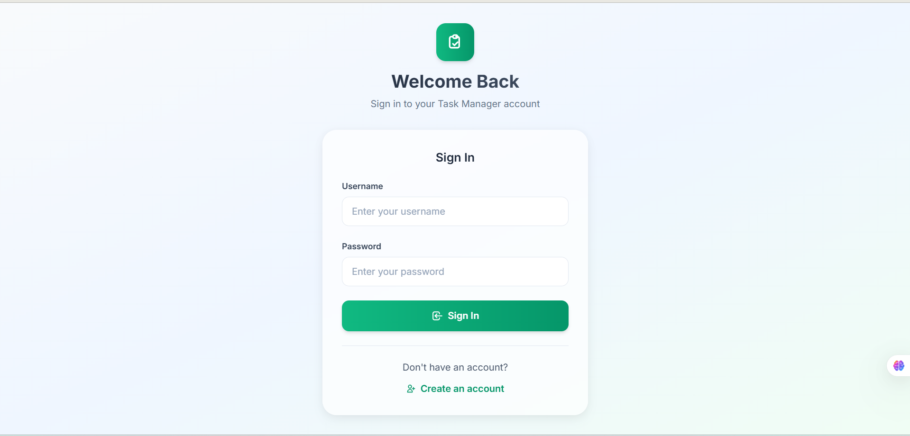
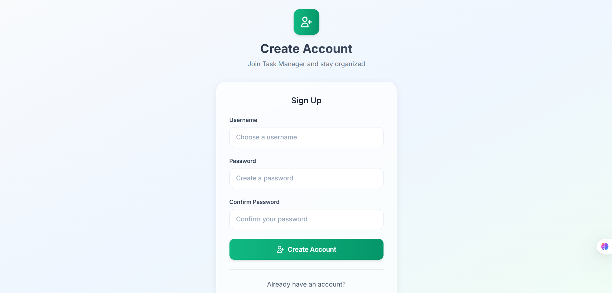
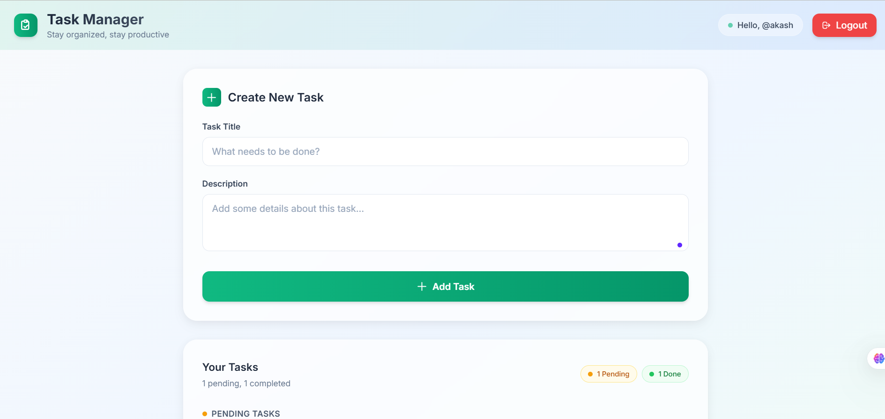
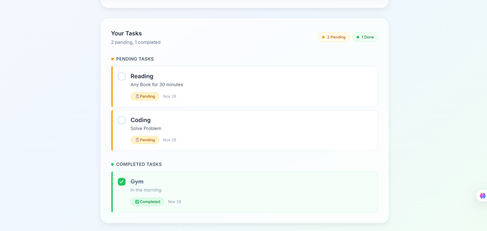

# 🧾 Task Management Application

A full-stack **Task Management App** that allows users to register, log in, and manage their tasks securely using **JWT Authentication**.  
Built with **React**, **Node.js**, and **MongoDB**, demonstrating modern frontend and backend practices.

## 📸 Demo Screenshots

### Authentication Pages
| Login Page | Signup Page |
|:----------:|:-----------:|
|  |  |

### Task Management Interface
| Dashboard | Tasks Management |
|:---------:|:----------------:|
|  |  |

## ✨ Features

-  **Secure Authentication** - JWT-based user registration and login system
-  **Complete Task Management** - Create, read, update, and delete tasks with real-time updates
-  **Inline Editing** - Edit tasks directly with form validation
-  **Task Status Toggle** - Mark tasks as complete or incomplete instantly
-  **Modern UI Design** - Beautiful glassmorphism design with emerald theme
-  **Fully Responsive** - Mobile-first design that works on all devices
-  **Secure & Protected** - Rate limiting, input validation, and protected routes
-  **Real-time Updates** - Instant feedback with loading states and animations

## 🛠️ Tech Stack

### Frontend Technologies
- **React 19.1.1** - Latest React with modern functional components and hooks
- **Redux Toolkit** - Efficient state management with modern Redux patterns
- **React Router Dom** - Client-side routing with protected routes
- **Tailwind CSS** - Utility-first CSS framework for rapid UI development
- **Axios** - Promise-based HTTP client for API requests
- **React Hook Form** - Performant forms with easy validation
- **Zod** - TypeScript-first schema validation

### Backend Technologies  
- **Node.js** - JavaScript runtime environment
- **Express.js** - Fast and minimal web framework
- **MongoDB Atlas** - Cloud-hosted NoSQL database
- **Mongoose** - MongoDB object modeling for Node.js
- **JWT (jsonwebtoken)** - Secure token-based authentication
- **bcryptjs** - Password hashing and security
- **Express Validator** - Server-side input validation and sanitization
- **Helmet** - Security middleware for HTTP headers
- **CORS** - Cross-Origin Resource Sharing configuration
- **Express Rate Limit** - Rate limiting middleware for API protection

## Local Setup

### Prerequisites
- Node.js
- MongoDB Atlas account

### 1. Clone Repository
```bash
git clone https://github.com/prajvl/Todo-react-app.git
cd Todo-react-app
```

### 2. Server Setup
```bash
# Navigate to server directory
cd server

# Install dependencies
npm install

# Create .env file
touch .env
```

Add the following environment variables to `server/.env`:
```env
NODE_ENV=development
PORT=5000
CLIENT_URL=http://localhost:3000
MONGODB_URI=your_mongodb_atlas_connection_string
JWT_SECRET=your_super_secret_jwt_key_here
```

### 3. Client Setup
```bash
# Navigate to client directory (from root)
cd client

# Install dependencies
npm install

# Create .env file
touch .env
```

Add the following environment variable to `client/.env`:
```env
REACT_APP_API_URL=http://localhost:5000/api
```

### 4. Database Setup
- Create MongoDB Atlas cluster
- Get connection string
- Update MONGODB_URI in server/.env

## How to Run

```bash
# Start backend
cd server
npm run dev

# Start frontend (new terminal)
cd client  
npm start
```

## 🔐 API Endpoints

### 🧑‍💻 Authentication
- **POST** `/api/auth/register` → Register a new user and get JWT token
- **POST** `/api/auth/login` → Log in and get JWT token

### 📝 Task Routes
- **GET** `/api/tasks` → Get all tasks of logged-in user
- **POST** `/api/tasks` → Create a new task
- **PUT** `/api/tasks/:id` → Update a specific task
- **DELETE** `/api/tasks/:id` → Delete a specific task

⚠️ **Note:** All `/api/tasks` routes require a valid JWT in the `authToken` header.
